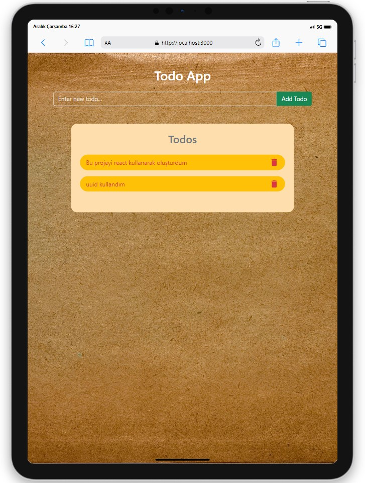

# Todo App

<div align="center">
  
</div>

## About the Project

This project is developed using React to create a simple todo application. The data is stored in the local storage, so even if you refresh the page or revisit it later, you can still access the entered data.

## Live Demo

[React Todo App]()

## Features

- Ability to add new tasks
- Ability to mark tasks as complete
- Ability to delete tasks
- Filtering completed tasks

## Project Skeleton

```
Todo App(folder)
|
|----readme.md         
SOLUTION
├── public
│     └── index.html
├── src
│    ├── assets
│    │       └── [images]
│    ├── components
│    │       ├── Header.jsx
│    │       │   
│    │       ├── TodoList.jsx         
│    ├── App.js
│    ├── index.js
│    └── index.css
├── package.json
└── yarn.lock
```

## Screenshots

<div align="center">
  
  
  
</div>

## Compatibility

The project is compatible with both wide-screen computers and mobile devices.

## Dependencies

- Bootstrap
- React-Bootstrap
- React-Icons
- UUID
